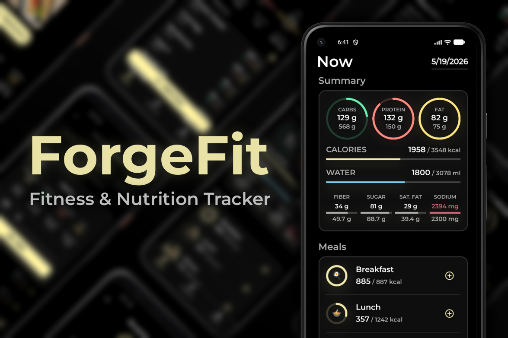
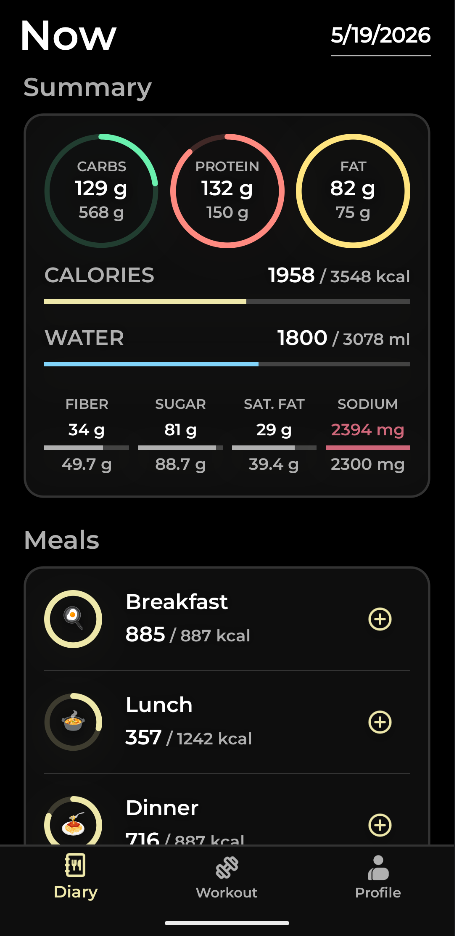
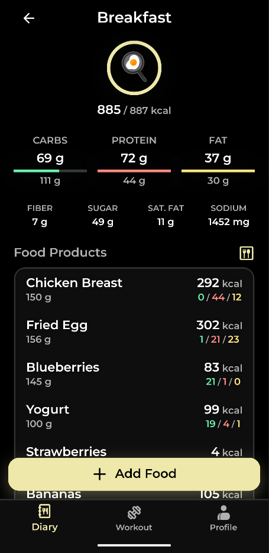
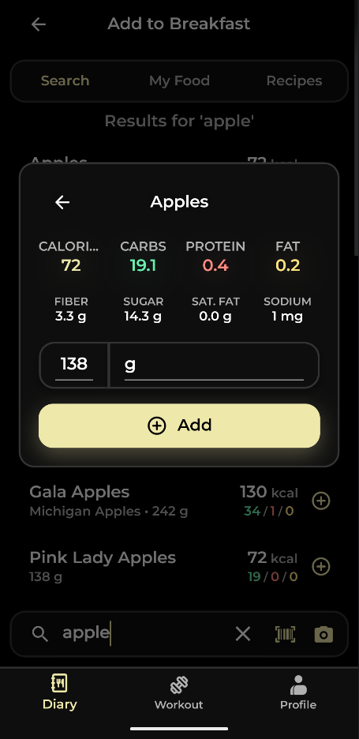
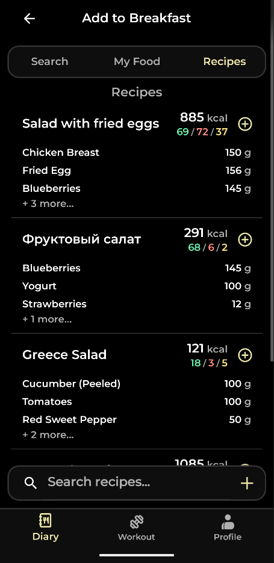
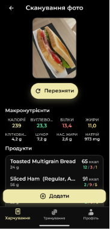

# ForgeFit | Fitness & Nutrition Tracker

<p align="center">
  
</p>

## Overview
ForgeFit is a cross-platform mobile application for tracking nutrition, managing workouts, and achieving body goals. Built completely on the .NET stack, it combines a Clean Architecture backend with a responsive MAUI frontend. 

This project demonstrates production-ready practices including Domain-Driven Design (DDD), Unit of Work, robust validation, and third-party API integrations.

## Tech Stack
* **Backend:** ASP.NET Core 9 Web API, C#
* **Frontend:** .NET MAUI
* **Database:** SQL Server, Entity Framework Core
* **Architecture:** Clean Architecture, DDD, Repository & Unit of Work patterns
* **Libraries:** Mapster, FluentValidation, MediatR, JWT Authentication
* **Infrastructure:** Docker & Docker Compose
* **APIs Integration:** FatSecret API (Nutrition), ExerciseDB API (Workouts)

## Key Features
* **Smart Nutrition Tracking:** Search foods via FatSecret API, scan meals by photo, create custom recipes, and track macros/water intake.
* **Workout Builder:** Create custom workout programs, track sets/reps/rest times, and utilize external exercise databases.
* **Goal Management:** Set and monitor body goals (weight, body fat) and daily nutritional targets.
* **Secure Identity:** Custom JWT-based authentication with refresh token rotation.

## Architecture & Engineering Decisions

The backend is built using **Clean Architecture** to ensure separation of concerns and maintainability.

* **Rich Domain Model (DDD):** Entities strictly encapsulate business rules. For example, `Recipe` and `FoodItem` use private setters and factory methods to guarantee an always-valid state. No anemic domain models here.
* **KISS & Scalable:** The domain events are already wired up with MediatR, laying the groundwork for a future Event-Driven Architecture or full CQRS. However, for the current scope, I intentionally stuck to a straightforward Controller-Service pattern. This avoids premature overengineering while keeping the project ready for easy scaling when needed.
* **Centralized Validation & Exception Handling:** FluentValidation at the API boundary and global exception middleware ensure clean controllers and consistent HTTP responses.

## Application Screenshots
<p align="center">
  
  
  
  
  
</p>

## Getting Started (Local Development)

The backend is fully containerized. You can spin up the API and SQL Server database easily via Docker.

```bash
git clone https://github.com/Wostan/ForgeFit.git
cd ForgeFit

# 1. Setup environment variables
cp .env.example .env

# 2. Start the environment
docker-compose up -d
```
